# 🔗 WowSearch — Find Files That Feel Related, powered by Gemma 4

---


## The Problem

Your files are silent. File Explorer stores them — but never understands them.

It can't tell you which music fits your video, or what that file even contains until you open it.

Finding the *right* combination is time-consuming, accidental, and exhausting.
And the more files you have, the worse it gets.


## What It Does
**WowSearch** is a tool powered by **Google's Gemma 4** model that understands your files both structurally and semantically, helping creators spark their next "Wow" idea.

### 💬 Chat-Based Multimodal Search & Recommendations

Using Gemma 4's enhanced multimodal reasoning capabilities, WowSearch lets you search across your files and discover ideal cross-media combinations through a natural chat interface.

Ask questions like:
- *"Which video clip best pairs with this background music?"*
- *"Find an image that complements this article."*
- *"What audio track fits the mood of this video?"*

Gemma 4's ability to reason across **video, audio, text, and image** modalities simultaneously powers these recommendations — going far beyond simple keyword search.


### 📊 File Relationship Graph Analysis

Upload a collection of files and WowSearch analyzes their relationships, visualizing semantic connections as an interactive **graph of nodes** and edges — so you can instantly see what your files have in common.

- Each **node** represents a file (document, image, audio clip, video, etc.)
- Each **edge** represents a detected relationship between two files (e.g., shared topics, citations, complementary content)
- The graph can be explored interactively to drill into specific connections


---

## Why Gemma 4?

We chose Gemma 4 because it thinks the way creators do.

Unlike conventional search, Gemma 4 reasons *across* media — recognizing 
that a melancholic piano piece and a foggy time-lapse belong together 
not by filename, but by feel. Its built-in thinking mode brings 
cloud-level reasoning to your local machine, without sending a single 
file outside your device.

Privacy without sacrificing intelligence. That's why Gemma 4 doesn't 
just power WowSearch — it makes WowSearch possible.


---


## Architecture Overview

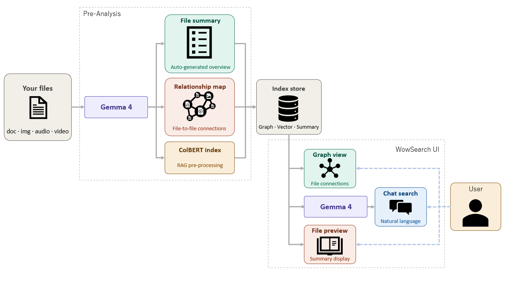


## 🛠️Installation
For environment setup and how to run the app, see the guide.

[Setup Guide](SetupGuide.md)

---

## Usage

### 1. Data Ingestion (This step may take up to 30 minutes or more)
Place the data files you want to analyze into the following directory:
```
gemma4_good_hackathon/DataFolder
```

WowSearch supports the following formats:

- **Text / Documents:** `.txt`, `.md`, `.pdf`, `.py`, `.html`
- **Images:** `.png`
- **Audio:** `.mp3` (up to 20 seconds)
- **Video:** `.mp4` (up to 60 seconds)

Then click the **Ingest** button in the app to load the files.

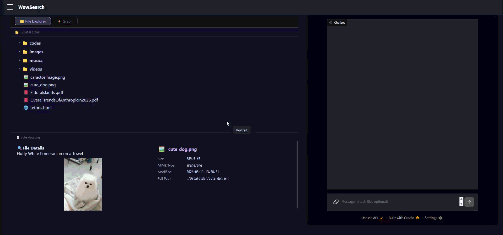


### 2. Chat-Based Search

You can ask natural language questions directly in the chat:

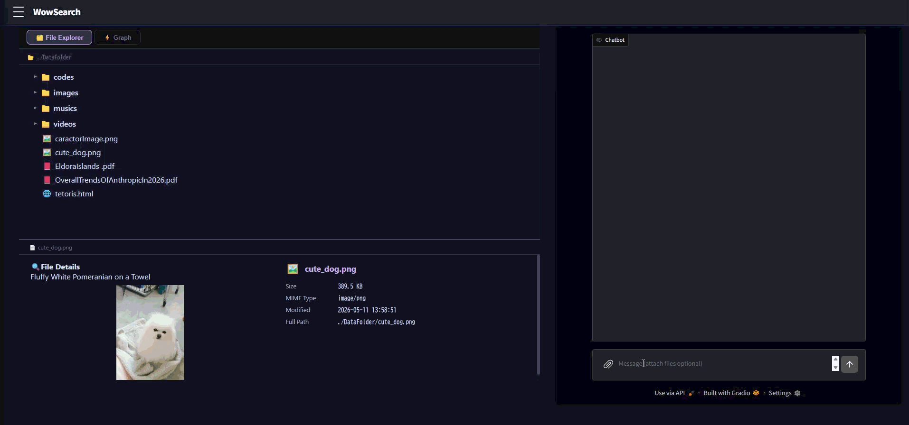

### 3. Explore the Relationship Graph

Once files are processed, the graph view renders automatically. You can:
- Click on a **node** to see file details
- Each **edge** shows why two files are connected

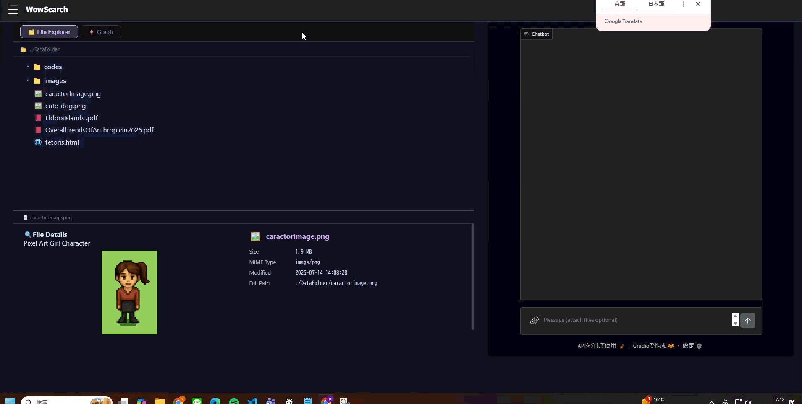


---

## Experiments and Results
### Exp 1: HTML File Input — Visual Improvement Suggestions

[Input html Link](./DataFolder/codes/RPG.html)


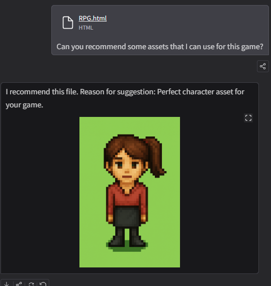


### Exp 2: Image Input — Audio File Suggestions

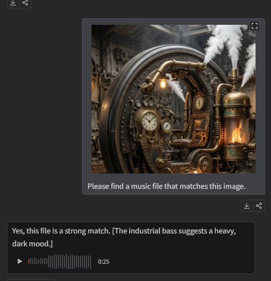

[Audio file Link](./DataFolder/musics/maou_bgm_orchestra20.mp3)


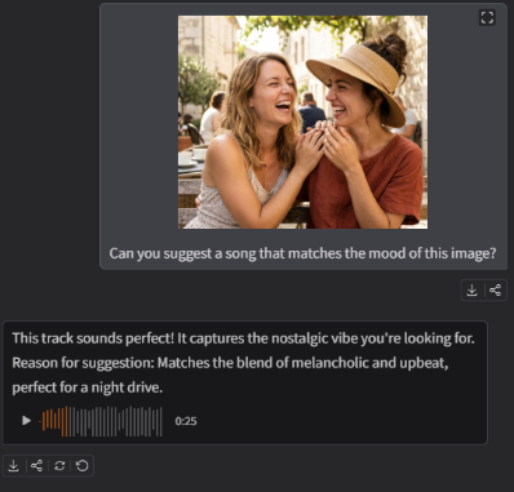

[Audio file Link](./DataFolder/musics/maou_bgm_acoustic27.mp3)


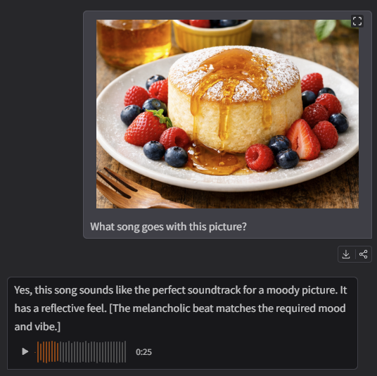

[Audio file Link](./DataFolder/musics/maou_bgm_cyber33.mp3)


### Exp 3: Video Input — Audio File Suggestions
[Input Video file Link](./DataFolder/videos/2932301-uhd_4096_2160_24fps.mp4)

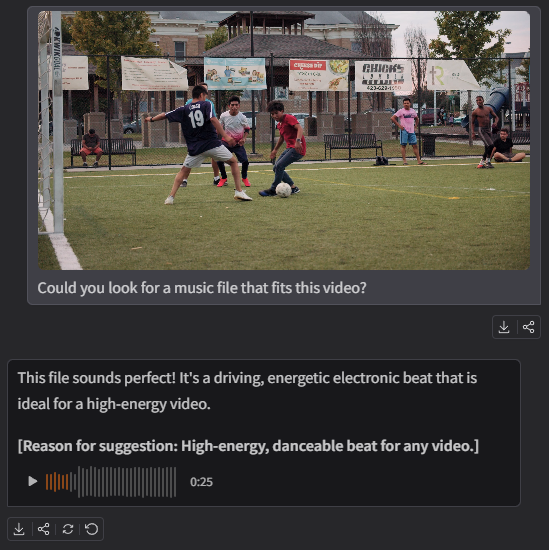

[Audio file Link](./DataFolder/musics/maou_bgm_neorock83.mp3)


### Exp 4: RAG-Based Q&A — Answering from Local Files

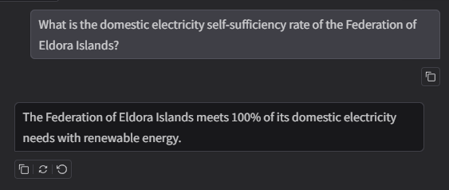

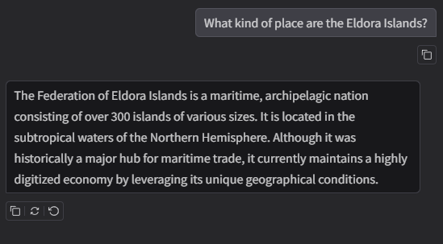


### Exp 5: Knowledge Graph Construction — Visualizing File Relationships

WowSearch constructs a knowledge graph from your local files, connecting files and concepts through meaningful relationships.

**Full Graph Overview**

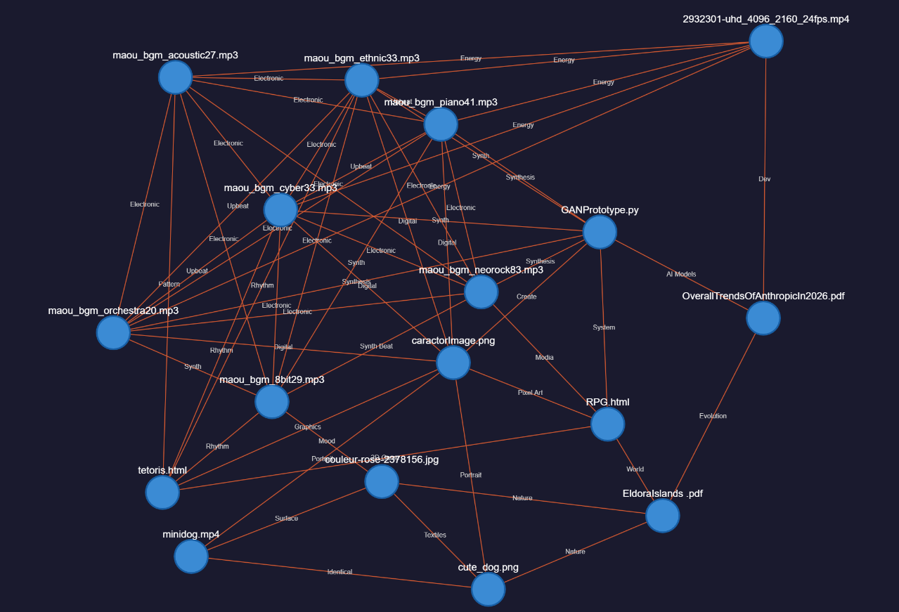

**Closer Look: File Relationships(RPG.html)**

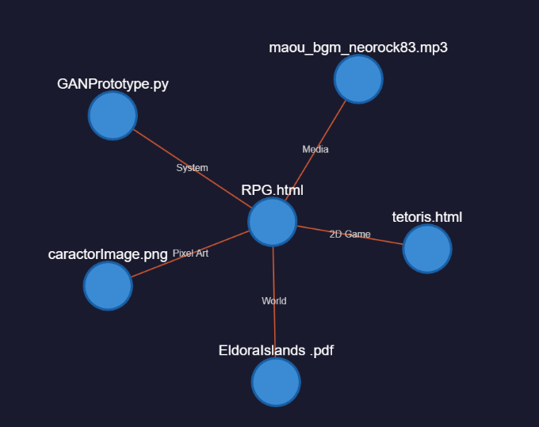


**Closer Look: File Relationships(cute_dog.pmg)**

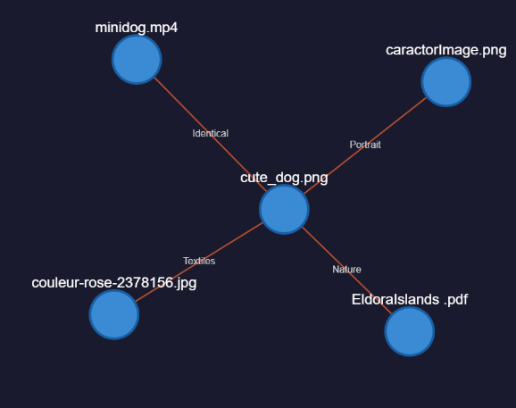


## Example Scenarios

### 🎬 Content Creator
Upload a batch of video footage, voiceover recordings, background music, and script drafts. WowSearch reveals which combinations are most coherent and suggests ideal pairings for your edit.

### 📚 Researcher
Drop in a collection of papers, figures, and datasets. The graph shows citation-like relationships and topic clusters — helping you see the "shape" of your research at a glance.

---


## Limitations & Known Issues
- Preprocessing time increases as the number of files grows. This is because the system performs an exhaustive pairwise comparison of all file combinations in order to build the knowledge graph.
- Audio and video file length is limited (Gemma4 only supports files of around a few tens of seconds)
- Chat-based search response time is not yet fast enough and remains an area for further optimization.
---

## References
- [Kaggle: Gemma 4 Good Hackathon](https://www.kaggle.com/competitions/gemma-4-good-hackathon)
- [Gemma 4](https://ai.google.dev/gemma) — Google's multimodal open model
- [colbert](https://huggingface.co/colbert-ir/colbertv2.0) — A retrieval model for efficient and accurate passage search
- [maoudamashii](https://maou.audio/) — Royalty-free audio source used for testing
- [Pexels](https://www.pexels.com/ja-jp/video/2932301/) — Royalty-free video materials used for testing
---

*Built for the Gemma 4 Good Hackathon.*
