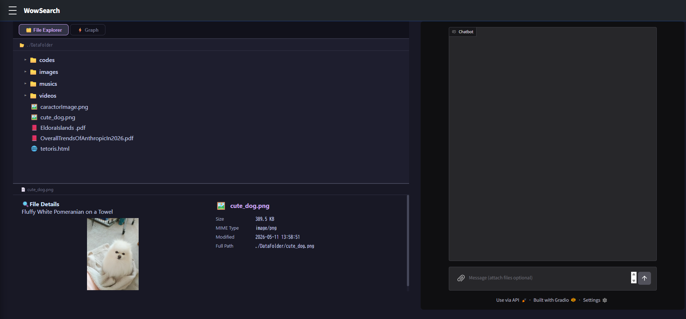

# 🚀 Setup Guide

### Clone the Repository
```bash
git clone https://github.com/yourname/gemma4_good_hackathon.git
cd gemma4_good_hackathon
```

### Set Up ColBERT
Download the ColBERT weights from the link below and place them in `colbert_weight/`.

[colbert-ir/colbertv2.0](https://huggingface.co/colbert-ir/colbertv2.0)

---

### Option A: without Ollama
**Tested Environment:**
- OS: Ubuntu
- Python: 3.10
- CUDA: 12
- GPU: NVIDIA RTX 4090

Download the Gemma 4 weights from the link below and place them in `gemma4_weights/`.

[google/gemma-4-E4B-it](https://huggingface.co/google/gemma-4-E4B-it)

**Install Dependencies:**
```bash
./installGemma4Env.sh
```

**Configure:**
Open `config.py` and set the following to disable Ollama mode:
```python
MODEL_TYPE = "local"
```


**Launch Gemma 4 API:**
```bash
CUDA_VISIBLE_DEVICES=0 python gemma4_api.py
```

---

### Option B: Ollama
> ⚠️ **Note:** Video and audio inputs are not supported in this mode.

Install Ollama and pull the model:

```bash
curl -fsSL https://ollama.com/install.sh | sh
ollama pull gemma4
```
**Configure:**
Open `config.py` and set the following to enable Ollama mode:
```python
MODEL_TYPE = "ollama"
```
Then set your machine's local IP address:

```python
OLLAMA_GEMMA4_APIURL = "http://<your-local-ip>:11434"
```

--- 

## Launch App (Common for Option A and B)
```bash
docker build -t wowsearch .
docker run --gpus all --network host -it --name wowsearch_container -v .:/app wowsearch:latest bash
./start.sh
```

---

## Access
Once launched, open your browser and navigate to the following URL to access the web app:

[http://127.0.0.1:7862/search](http://127.0.0.1:7862/search)

If the setup was successful, you should see the following screen:




